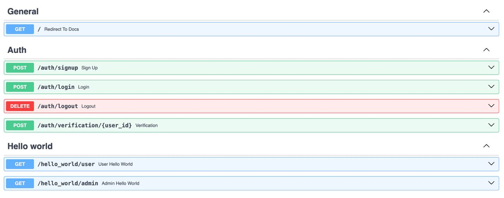
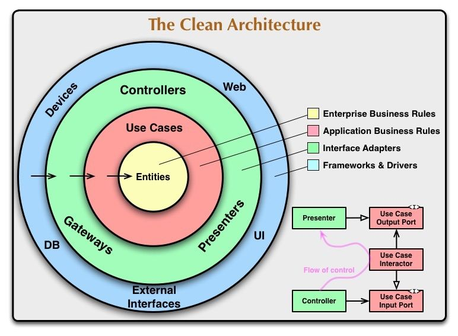

# Введение
Проект, реализующий работу с:
1. Web sessions
2. RBAC
3. Дневное планирование маршрутов выездных инженеров

# Проект
## Технологический стек
- **Python**: `3.12`
- **Production**: `alembic`, `dishka`, `fastapi`, `psycopg`, `sqlalchemy[async]`, `gunicorn`, `ortools`, `httpx`
- **Development**: `isort`, `ruff`, `pre-commit`


## Как работает расчёт маршрутов

- [Для продакта: маршруты и смысл валидатора](docs/ROUTING_FOR_PRODUCT.md).
- [Для аналитика и разработчика: технический разбор и результаты ревью](docs/ROUTING_FOR_ANALYST.md).
- [Объяснение для демо и разбор кода OR-Tools](docs/ROUTING_ALGORITHM.md).
- [Актуальность ТЗ, состав рефакторинга и проверки](docs/refactoring/ORTOOLS_REFACTOR.md).

## API
<p align="center">
  
  <br><em>Handlers</em>
</p>

### Районы и доступ диспетчеров

В пользовательском интерфейсе техническая сущность `project` называется
районом. Все заявки, инженеры, справочники, оборудование и результаты
планирования по-прежнему изолированы по `project_id`.

- инженер относится ровно к одному району через `users.project_id`;
- диспетчер может относиться к нескольким районам через
  `dispatcher_projects` или временно не иметь районов;
- `GET /api/project/available-projects` возвращает активные районы текущего
  диспетчера;
- рабочие CRUD-запросы диспетчера используют явный префикс
  `/api/projects/{project_id}/workspace`;
- backend проверяет связь диспетчера с районом для каждого такого запроса.

Старые маршруты `/api/project/...` сохранены для совместимости только с
диспетчерами, которым назначен ровно один активный район.

### General
- '/': Открыт для **всех**
   - Перенаправляет на Swagger документацию

### Auth (`/auth`)

- 'signup' (POST): Открыт для **всех**
  - Регистрация аккаунта
- 'login' (POST): Открыт для **всех**
  - Вход в аккаунт
- 'logout' (DELETE): Открыт для **всех**
  - Выход с аккаунта
- 'verification/{user_id}': Открыт для **всех**
  - Верификация аккаунта, проходя по ссылке из письма на почте

### Hello world (`/hello_world`)
- 'user' (GET): Открыт для **user**
  - return: Hello world by user
- 'admin' (GET): Открыт для **admin**
  - return: Hello world by admin

### Planning (`/api/projects/{project_id}/planning`)

- `runs` (POST): запуск расчёта текущего дня, доступен **admin**
- `runs/{run_id}` (GET): результат расчёта, доступен **user/admin**
- `runs` (GET): история расчётов, доступна **user/admin**
- `batches` (POST): асинхронный запуск управляемого каскада на 7–30 дней;
- `batches/{batch_id}` (GET): прогресс, рассчитанные дни и остаток;
- `batches/{batch_id}/stop` (POST): идемпотентная безопасная остановка;
- `batches/{batch_id}/validate-current-day` (POST): проверка актуальности перед
  публикацией текущего дня.
- `context` (GET): текущая дата и IANA timezone проекта для интерфейса;
- `runs/{run_id}/publish` (POST): публикация текущего дня из batch владельцем
  или диспетчером выбранного проекта.

Тело запуска:

```json
{
  "planning_date": "2026-09-12",
  "timezone": "Asia/Yekaterinburg"
}
```

Timezone должен совпадать с timezone проекта. Все абсолютные времена в ответах
возвращаются в UTC. Интерактивная документация доступна в `/docs`.

Для запуска batch обязателен заголовок `Idempotency-Key`, а
`requested_start_date` должна совпадать с текущей датой в timezone проекта:

```json
{
  "requested_start_date": "2026-09-14"
}
```

Каждая дата каскада создаёт отдельный `planning_run` и отдельную модель OR-Tools.
Завершённые дни сохраняются атомарно, а после перезапуска приложения обработка
продолжается с первой незавершённой даты.

### Динамическое планирование

Создание заявки и запись `planning_event` выполняются одной транзакцией. Для
событий создания и импорта действует настраиваемое окно объединения: 30 секунд
после последнего события, но не более 2 минут от первого. Если во время расчёта
появились другие события проекта, они объединяются в следующий проход.
Сериализация между процессами обеспечивается PostgreSQL advisory lock; сама БД
остаётся источником восстановления после рестарта.

- заявка со сроком позже текущего дня запускает каскад с завтра и не меняет
  сегодняшний план;
- новая заявка со сроком сегодня обязательно проверяется отдельной моделью для каждого
  подходящего инженера, кандидаты сравниваются сохранённым лексикографическим
  вектором;
- `COMPLETED`, `IN_PROGRESS`, следующая остановка и первая остановка после начала
  смены образуют защищённый префикс; старый сегодняшний хвост не переносится к
  другому инженеру;
- после одного будущего каскада весь достигнутый горизонт атомарно публикуется как
  новая `project_plan_version`; предыдущая версия и изменения сохраняются;
- ручной запуск: `POST /api/project/planning/events/manual`;
- состояние события: `GET /api/project/planning/events/{event_id}`;
- актуальная версия и diff: `GET /api/project/planning/current`;
- история версий: `GET /api/project/planning/versions` и
  `/planning/versions/{version_id}`;
- семидневная доска текущего плана: `GET /api/project/planning/board`;
- результат отдельного дня: `GET /api/project/planning/board/{planning_date}`;
- объяснение решения по заявке:
  `GET /api/project/planning/day-results/{day_result_id}/jobs/{job_id}/explanation`;
- CSV-пакет заявок: `POST /api/projects/{project_id}/job-imports`, просмотр
  состояния и ошибок через `/job-imports/{batch_id}` и
  `/job-imports/{batch_id}/issues`, атомарное создание через
  `/job-imports/{batch_id}/apply`. Обязательные колонки: `Тип заявки ВК`,
  `Начало`, `Окончание`, `Адрес`.

Владелец проекта использует те же read-модели через префикс
`/api/projects/{project_id}/planning`. Ответ доски всегда содержит семь дат от
текущей даты проекта, идентификаторы версии/результата и ровно один итог для
каждой заявки расчёта: назначение, перенос за горизонт или неназначение с
безопасным кодом причины. Для давно сохранённых результатов, в которых нет
расширенного снимка, API возвращает нейтральные подписи вместо технической
ошибки. Если версия изменилась между запросами, ответ `409 VERSION_CHANGED`
указывает клиенту перечитать доску целиком.

Read model связывает каждую дату опубликованной версии с неизменяемым
`planning_run` и его `input_snapshot`. Для каждого идентификатора заявки из
`DayInput` API проверяет ровно один исход: назначение либо неназначение. Текущие
справочники не используются для восстановления исторических требований;
допускается показать только изменившийся операционный статус и признак
`current_data_changed`.

Публичные reason codes: `OPTIMIZER_SELECTED`, `WORK_TYPE_PRIORITY`,
`OVERDUE_PRIORITY`, `SLA_DUE_TODAY`, `HARD_CONSTRAINTS_MATCHED`,
`NO_ELIGIBLE_ENGINEER`, `NO_QUALIFICATION`, `NO_EQUIPMENT`, `NO_SHIFT`,
`NO_TRANSPORT`, `TIME_WINDOW_CONFLICT`, `SHIFT_CAPACITY_EXCEEDED`,
`ROUTE_INFEASIBLE`, `DROPPED_BY_OBJECTIVE`, `TIME_LIMIT_NO_ASSIGNMENT`,
`HORIZON_EXHAUSTED`, `CANCELLED_RECORD` и `RESULT_DATA_UNAVAILABLE`.
Неизвестный код не выводится пользователю: API возвращает безопасный текст и
пишет событие `unknown_planning_reason`.

Ночной запуск настраивается полями `nightly_planning_enabled` и
`nightly_planning_time` активной конфигурации проекта. Он использует тот же
алгоритм защиты и публикации, что и ручной запуск.

## Файловая структура

```
.
├── conf # конфиги
├── docs # документация
└── src
    ├── auth
        ├── application # логика приложения и интерфейсы
        ├── domain # модели
        ├── entrypoint # настройка запуска
        ├── infrastructure # адаптеры
        └── presentation # внешнее общение
    └── planning # дневное планирование в тех же слоях

```

## Описание схем реляционной базы данных
Использован императивный подход. С помощью `map_imperatively` была смаплена доменная модель в представление базы данных.

## Зависимости
Приложение разделено на слои:
1. Domain
2. Application
3. Infrastructure
4. Presentation

<p align="center">
  
  <br><em>Чистая архитектура, Роберт Мартин</em>
</p>

- Соблюден принцип инверсии зависимотей
- Зависимости доставляются при помощи инъекции зависимостей, используя di-framework Dishka

## Переменные окружения
Для работы проекта необходимо настроить переменные окружения. В корне проекта подготовлены шаблоны:
- `.env.example` — используйте для локального запуска сервисов (localhost).
- `.env.docker.example` — используйте для запуска всего стека через Docker Compose.

Скопируйте нужный шаблон в соответствующий файл (`.env` или `.env.docker`) и заполните актуальные значения перед запуском.

## Как запустить
1. Склонируй проект
2. Заполни переменные окружения
3. Подними проект ``docker compose up --build``. Первый импорт OSM-данных для
   Valhalla и Nominatim может занять продолжительное время.
   По умолчанию используется экстракт Центрального федерального округа: он
   включает Москву и Московскую область (в тестовых CSV есть адреса Домодедова,
   Ступина и Каширы). Поиск адресов ограничен прямоугольником вокруг этих
   территорий через `NOMINATIM_VIEWBOX`. Если сервисы ранее запускались с
   данными Пермского края, их постоянные тома `nominatim-data` и `valhalla-data`
   нужно пересоздать перед импортом нового экстракта. Том `postgres-data`
   приложения при этом сохраняется.
4. Проведи миграции. Либо напрямую в контейнере, либо ``make migrate`` в терминале
5. При необходимости создай демонстрационные данные Перми:
   ``make seed-planning-demo``. Для этого укажи в env-файле
   ``OSM_PBF_URL=https://download.openstreetmap.fr/extracts/russia/volga_federal_district/perm_krai-latest.osm.pbf``
   и ``NOMINATIM_VIEWBOX=50.5,62.0,60.5,55.5``. Эти значения отличаются от
   центрального экстракта и прямоугольника в шаблонах. Перед запуском с ними
   пересоздай тома ``nominatim-data`` и ``valhalla-data``.

Для быстрого запуска solver без геосервисов укажи в `planning_config.travel_provider`
значение `STATIC_TEST`. Для дорожных матриц OpenStreetMap используется
`VALHALLA_LOCAL`.

По умолчанию адреса по-прежнему геокодируются через Nominatim. Чтобы целиком
переключить геокодирование планов, адресные подсказки и CSV-импорт на Yandex,
укажите `USE_YANDEX_GEOCODER=true` и заполните `YANDEX_GEOCODER_API_KEY`.
Необязательный `YANDEX_GEOCODER_BBOX` задаётся в формате
`долгота,широта~долгота,широта`; если он пуст, границы автоматически
преобразуются из `NOMINATIM_VIEWBOX`.

## Полезные материалы
1. Web sessions - https://cheatsheetseries.owasp.org/cheatsheets/Session_Management_Cheat_Sheet.html
2. OAuth2 - https://auth0.com/docs и https://oauth.net/
# Импорт заявок из CSV

После миграции Alembic `e37b19a5c200` диспетчер и владелец могут загружать CSV
через `POST /api/projects/{project_id}/job-imports`. Проверка выполняется в фоне;
состояние и ошибки доступны через `GET` маршруты того же раздела. Применение
проверенного пакета выполняется отдельным `POST .../{batch_id}/apply` с UUID в
заголовке `Idempotency-Key`. Исходный файл и результаты проверки хранятся в БД;
файл удаляется через 30 дней фоновым обслуживанием, результаты и аудит остаются.

### Транспорт исполнителя

В профиле инженера доступны: автомобиль (CAR), пешеход (NONE, сохранён для
совместимости), велосипед (BICYCLE), общественный транспорт (PUBLIC_TRANSPORT).
Профиль применяется к матрицам оптимизатора, проверке плана и маршрутам на карте.
Поле в БД уже строковое; миграция существующих пеших исполнителей не требуется.
После изменения транспорта пересчитайте план, чтобы обновить назначенные маршруты.

Общественный транспорт использует Valhalla multimodal (пешие участки и поездки).
Нужен граф Valhalla с расписаниями GTFS для обслуживаемого региона.
`docker-compose.yml` монтирует `data/gtfs` и включает импорт расписаний и часовых
поясов при построении графа. Если мультимодальный граф не построил маршрут,
приложение пробует пеший путь и явно отмечает запасной вариант на карте.
Без подготовленного набора поездки на автобусе и трамвае не появятся.
Автомобильный профиль не подставляется вместо общественного транспорта.

Для локального набора Москвы из Mobility Database подготовьте файлы командой
`python scripts/prepare_gtfs.py "C:\\путь\\к\\mdb-3226-202606301640.zip"`.
Скрипт читает ZIP, оставляет стандартные GTFS-поля и создаёт
`data/gtfs/moscow/{agency,calendar,routes,stops,stop_times,trips}.txt`.
Если исходный архив содержит `frequencies.txt`, его интервалы также сохраняются.
По умолчанию он выбирает рейсы, чьи календари пересекаются с ближайшими 30 днями,
и отбрасывает ссылки на отсутствующие рейсы и остановки. `source.json` показывает
конец окна выбора и последнюю дату выбранных календарей,
число строк и отфильтрованных записей. Исходный ZIP остаётся без изменений.
Данные не добавляются в Git. Затем запустите
`docker compose up -d valhalla` (или весь стек) и дождитесь `/status`.
Проверьте `docker compose logs valhalla`: в сообщениях импорта должно быть
ненулевое число transit tiles. Если контейнер уже построил старый дорожный граф,
пересоберите транзитные тайлы и архив дорожного графа. Иначе сервер может
загрузить старый граф без соединений с остановками:

```sh
docker compose --env-file .env.docker stop valhalla
docker compose --env-file .env.docker run --rm --no-deps -e build_transit=Force -e build_tar=Force -e serve_tiles=False valhalla
docker compose --env-file .env.docker up -d valhalla
```

Команда заново строит и дорожные тайлы; для полного московского фида это может
занять десятки минут. Она меняет граф Valhalla в томе `valhalla-data`, не базу
приложения. Исходный
набор содержит автобусы, трамваи и одну канатную дорогу. Метро добавляется
отдельной интервальной моделью ниже. Для обновления данных остановите Valhalla, переместите старую
папку `data/gtfs/moscow` в архив, повторите подготовку нового ZIP и пересоберите
транзитные тайлы. Повторите обновление к дате `selection_window_end` из
`source.json`, чтобы будущие маршруты не рассчитывались по неполному набору
рейсов; интервал можно изменить через `--horizon-days`.

### Интервальная модель метро в GTFS

`scripts/build_metro_interval_gtfs.py` строит отдельный фид
`data/gtfs/moscow_metro_model` из схемы MosMetro API. Он использует станции,
связи между ними, пересадки и опубликованные в схеме времена первого/последнего
поезда по направлению. `connections.pathLength` трактуется как оценка секунд
между станциями, как это делает wrapper; единицы и точность источника не
проверены независимо. Для развилки Филёвской линии моделируются поездки от
начала линии к каждому конечному пункту. Эти допущения записаны в
`model_info.json` вместе с хешем схемы и сроком действия фида.

МЦД и МЦК исключены из метро-модели: их нельзя корректно считать метро с теми
же интервалами. Список исключённых линий записан в `excluded_rail_lines`.
Модель создаёт повторяющийся календарь на пять лет для долгосрочного
планирования; это не означает, что схема станций будет оставаться актуальной.
После изменения линий или измеренных интервалов фид и граф нужно обновить.

Интервалы редактируются в `config/metro_headways.json`: отдельно для будней и
выходных, с возможностью переопределить конкретную линию через
`line_overrides`. Значения по умолчанию служат демонстрационной моделью, а не
официальным графиком. Каждое временное окно записывается отдельным рейсом в
`frequencies.txt` с `exact_times=0`: GTFS не утверждает, что поезд отправится в
конкретную минуту. Чем точнее измерены интервалы и ход между станциями, тем
точнее будет планирование. Исходный наземный GTFS остается отдельным фидом.

MosMetro adapter входит в `docker compose` и запускается вместе со стеком на
`http://localhost:8083`. Он содержит только два нужных приложению запроса:
схему станций и построение пути. Внешние функции исходного проекта (Telegram,
Тройка, MosTrans и личный кабинет) в репозиторий не перенесены. Чтобы собрать
GTFS-модель из схемы, сначала поднимите локальный сервис:

```sh
docker compose --env-file .env.docker up -d --build mosmetro
python3 scripts/build_metro_interval_gtfs.py --schema-url http://localhost:8083/mosmetro/schema
```

При повторной генерации добавьте `--replace`; прежний фид сохраняется ZIP-архивом
в `data/gtfs`. После изменения GTFS остановите Valhalla и пересоберите транзитные
и дорожные тайлы с `build_transit=Force` и `build_tar=Force`, затем запустите её
снова:

```sh
docker compose --env-file .env.docker stop valhalla
docker compose --env-file .env.docker run --rm --no-deps -e build_transit=Force -e build_tar=Force -e serve_tiles=False valhalla
docker compose --env-file .env.docker up -d valhalla
```

На карте Valhalla выбирает наземный транспорт или метро для конкретного
времени отправления. Если маршрут Valhalla не содержит транспорта, MosMetro API
остаётся запасным вариантом; для него ожидание поезда оценивается настройкой
`MOSMETRO_WAITING_SECONDS` (по умолчанию 180 секунд).
Запасной API допускается только в консервативном окне 05:30–01:00 по Москве:
он не даёт датированного расписания, поэтому поездка за границами этого окна
не предлагается. Если вечерний маршрут требует долгого ожидания до утра,
backend сравнивает его с пешим путём и выбирает более быстрый. Для каждого
переезда общественного транспорта оптимизатор
получает отдельный маршрут на дату и время планирования. Если мультимодальный
маршрут недоступен, Valhalla отдельно строит пеший путь для этой пары. Если
недоступны оба варианта, переезд запрещён. Запросы выполняются пакетами по
восемь, поэтому число одновременно
созданных задач не растёт вместе с размером плана.

Экран карты выделяет автомобиль, пеший ход, велосипед, автобус, трамвай и метро
разными цветами. Кнопка сравнения для общественного транспорта заново запрашивает
маршруты на текущий выезд, через 30 и через 60 минут.
После сборки метро-фида и пересборки Valhalla проверьте модель командой
`docker compose --env-file .env.docker exec backend python scripts/smoke_metro_gtfs.py`.

У multimodal нет sources_to_targets: направленные пары запрашиваются через route
с датой планирования и временем начала самой ранней смены этого профиля.
Это первая оценка для статического оптимизатора. После выбора порядка заявок
каждый используемый переезд запрашивается на фактическое время отправления.
Если время изменилось, оптимизатор перестраивает расписание и повторяет проверку.
План с непроверенным временем поездки не публикуется.
Такие матрицы не сохраняются в семидневном дорожном кэше; снимки разделены по
дате и времени. На карте каждый участок запрашивается на фактическое расчётное
время отправления после предыдущей работы. Сравнение трёх вариантов выезда
отдельно перестраивает маршруты по расписанию.
Стоимость получения транзитной матрицы растёт квадратично с числом точек;
действует общий лимит времени расчёта.

### Локальный запуск и проверка четырёх типов транспорта

Команды выполняются из каталога backend. Для всех четырёх профилей нужны
PostgreSQL, Valhalla и Nominatim. Для поездок на общественном транспорте также
нужен GTFS-фид Москвы, покрывающий дату демонстрации: в чистом checkout его нет.

```bash
test -f .env.docker || cp .env.docker.example .env.docker
# Укажите собственный POSTGRES_PASS в .env.docker.
# Для запасного метро-маршрута нужен MOSMETRO_URL=http://mosmetro:8083.
python3 scripts/prepare_gtfs.py data/gtfs/mdb-3226-202606301640.zip
docker compose --env-file .env.docker up -d --build mosmetro
test -d data/gtfs/moscow_metro_model || python3 scripts/build_metro_interval_gtfs.py --schema-url http://localhost:8083/mosmetro/schema
docker compose --env-file .env.docker up --build -d
docker compose --env-file .env.docker ps
curl -fsS http://localhost:8002/status
curl -fsS http://localhost:8083/health
curl -fsS http://localhost:8000/docs >/dev/null
```

Если ZIP наземного транспорта называется иначе, передайте его путь скрипту.
Не повторяйте `prepare_gtfs.py` для уже подготовленного фида: при том же архиве
и окне скрипт возвращает сохранённый отчёт. Генератор метро откажется затирать
готовый фид; для обновления используйте `--replace`, сохраняя старую версию в ZIP.
Подготовка обоих GTFS должна предшествовать первому построению графа Valhalla.
Если Valhalla уже запускалась без этих фидов, выполните пересборку тайлов по
инструкции выше. Проверьте в `docker compose --env-file .env.docker logs valhalla`,
что импортировано ненулевое число transit tiles. MosMetro даёт резервный вариант
для метро; наземные автобусы и трамваи требуют GTFS. `smoke_metro_gtfs.py`
проверяет выбор метро утром и днём, а поздно вечером — отсутствие ожидания до
утра без резервного API:

```bash
docker compose --env-file .env.docker exec backend python scripts/smoke_metro_gtfs.py
```

Для проверки конкретного дня добавьте `--date 2026-09-27`; без аргумента
используется сегодняшняя дата Москвы.

Для показа четырёх профилей без изменения существующих районов можно создать
отдельный московский демо-район. Скрипт создаёт диспетчера, четырёх инженеров
(CAR, NONE, BICYCLE, PUBLIC_TRANSPORT) и по две заявки для каждого. Дата
показа передаётся через `--date`; если она в будущем, сегодняшние смены не
пересекаются с окнами заявок, поэтому план назначит их на указанную дату.

```bash
docker compose --env-file .env.docker exec -T backend python scripts/prepare_transport_demo.py --date 2026-09-27
docker cp backend:/tmp/transport-demo-20260927.json /tmp/transport-demo-20260927.json
chmod 600 /tmp/transport-demo-20260927.json
```

Логин и пароль диспетчера находятся в `accounts[0]` сохранённого файла.
Сохраните его вне Git: после пересоздания контейнера внутренний `/tmp` пропадёт.
Откройте фронтенд, войдите под демо-диспетчером, выберите район «Демо транспорта»
и на экране планирования запустите перерасчёт. Во вкладке даты показа должны
появиться четыре маршрута. При повторном запуске скрипт не изменяет уже
созданный район и учётную запись.
Если установлен локальный `.venv`, повторить вход, запуск расчёта и проверку
доски можно командой
`.venv/bin/python scripts/smoke_local_demo.py /tmp/transport-demo-20260927.json --plan-only`.
Она запускает новый расчёт только в созданном демо-районе.

Фронтенд запускается в соседнем каталоге (нужен Node.js и npm):

```bash
cd ../ship-it-frontend
npm ci
npm run dev
```

Откройте адрес, показанный Vite. В интерфейсе выберите район, создайте четырёх
инженеров с типами «Пешеход», «Автомобиль», «Велосипед», «Общественный транспорт»,
укажите стартовые адреса и рабочие смены. Создайте подходящие заявки, запустите
расчёт, затем проверьте назначения и карту для выбранного дня. При изменении
типа транспорта у существующего инженера запустите новый расчёт: ранее
опубликованный план сохраняет старые времена переездов. На карте проверьте
разные цвета способов передвижения и сравнение времени выезда для общественного
транспорта. Владелец и диспетчер с несколькими районами используют тот же
маршрут выбранного района.

Для проверки кода без геосервисов: в backend выполните `uv sync --group test`,
затем `.venv/bin/python -m pytest tests/unit/infrastructure/test_transport_modes.py -q`,
во frontend — `npm test && npm run build`.

### Ограничение кандидатов матрицы

Переменная `MATRIX_CANDIDATE_LIMIT` ограничивает число новых дорожных запросов для каждой исходной точки. Например, значение `50` оставляет 50 ближайших некэшированных направлений. Значение `0` или отсутствие переменной отключает ограничение. Кэшированные пары сохраняются независимо от лимита, а матрица возвращается исходного размера; исключённые новые пары остаются недоступными оптимизатору. Для хакатона рекомендуется 30–50.
