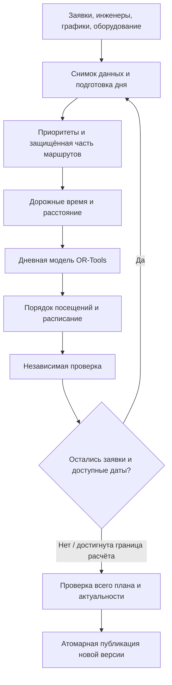

# Как система строит маршруты инженеров

Документ для демо и разбора кода. Описывает фактическую реализацию на 21 сентября
2026 года, после стилистического рефакторинга. Проверенная версия OR-Tools:
**9.15.6755**. Бизнес-правила при рефакторинге не менялись.

Для выступления достаточно разделов 1–5. Для системного аналитика и разработчика —
разделы 6–12. История требований, состав изменений и проверки находятся в
[отчёте о рефакторинге](refactoring/ORTOOLS_REFACTOR.md).

## 1. Объяснение заказчику за одну минуту

> Система получает заявки, графики и возможности инженеров. Для каждой пары точек
> она узнаёт время и расстояние по дорогам с учётом способа передвижения инженера.
> Затем подбирает распределение заявок и порядок посещений, соблюдая обязательные
> условия: квалификацию, транспорт, рабочую смену, окно начала работ и оборудование.
>
> Среди допустимых вариантов система в первую очередь старается сохранить
> приоритетные заявки. При одинаковом результате по заявкам она предпочитает
> задействовать меньше инженеров, затем уменьшает общий пробег, максимальный пробег
> одного инженера и время дороги.
>
> Поиск ограничен временем. Найденный план дополнительно проверяется. Неназначенные
> заявки рассматриваются на следующих датах. Проверенный и актуальный план
> публикуется общей версией, которую видят диспетчер и инженеры.

Корректная формулировка результата: **«найден допустимый маршрут с оптимизацией по
заданным приоритетам»**. При статусе по лимиту времени нельзя обещать, что среди
всех возможных вариантов математически не существует лучшего.

## 2. Что делает OR-Tools, а что делает наше приложение

OR-Tools получает уже подготовленную числовую задачу на один день: инженеров,
заявки, допустимые назначения, время дорог, ограничения и стоимости. В ответ
выбирает исполнителей и последовательность посещений.

| Вопрос | Кто отвечает |
| --- | --- |
| Где находится адрес? | Геокодер Nominatim переводит адрес в координаты. |
| Сколько ехать между двумя точками? | Valhalla возвращает время и расстояние по локальным данным OpenStreetMap. |
| Какие заявки важнее? | Прикладной код рассчитывает SLA-группы и штрафы за пропуск. |
| Кому и в каком порядке ехать? | `RoutingModel` OR-Tools ищет допустимое распределение с меньшей оценкой. |
| Можно ли менять уже начатую работу? | Прикладной сервис защищает часть сегодняшнего маршрута до вызова OR-Tools. |
| Что делать с остатком завтра? | Сервис многодневного каскада повторяет дневной расчёт. |
| Когда результат виден пользователю? | Проверки и транзакция публикации создают новую версию плана. |



Схема показывает общий каскад. При срочной вставке сначала сравниваются кандидаты
на сегодня и только затем запускается один будущий каскад.

## 3. Основной use case: диспетчер рассчитывает маршруты

### Исходные данные

Учебный пример: день ещё не начат, нет защищённых назначений, все три заявки имеют
одинаковую SLA-группу и обычный приоритет. Часы приведены в локальном времени
проекта; в тесте используется UTC. Время и расстояние условные, заданные таблицей,
а не полученные с реальной карты Перми.

| Инженер | Смена | Транспорт | Квалификация |
| --- | --- | --- | --- |
| Анна | 08:00–12:00 | Автомобиль | Оптика |
| Борис | 08:00–10:00 | Пешком | Настройка оборудования |

На проект доступен **один оптический прибор**.

| Заявка | Окно начала | Работа | Требования |
| --- | --- | --- | --- |
| A | 08:00–09:00 | 40 минут | Оптика, автомобиль, прибор |
| B | 09:30–10:00 | 30 минут | Оптика, автомобиль, прибор |
| C | 08:00–09:15 | 20 минут | Настройка оборудования |

В этом учебном наборе каждый ненулевой автомобильный переход занимает 10 минут
и 3 км, каждый пеший — 5 минут и 400 м. Матрица полностью определена, поэтому
результат можно воспроизвести без геосервисов.

### Что происходит после запуска

1. **Фиксируются исходные данные.** Расчёт использует одну согласованную версию
   заявок, графиков, требований и настроек.
2. **Проверяется возможность назначения.** A и B подходят Анне. C подходит Борису.
   Дешёвая дорога не позволяет нарушить квалификацию или требование автомобиля.
3. **Загружается дорожная таблица.** Для каждого профиля есть свои время и
   расстояние от старта к заявкам и между заявками.
4. **OR-Tools строит и улучшает варианты.** В нашем примере Анна может выполнить
   A, затем B. Один прибор остаётся у неё на весь день и используется дважды.
5. **Собирается расписание.** При раннем приезде допускается ожидание окна.
6. **План проверяется и публикуется.** Диспетчер видит порядок заявок и времена,
   каждый инженер — свои назначения.

### Полученное расписание

| Инженер | Действие | Время |
| --- | --- | --- |
| Анна | Выезд от старта | 08:00 |
| Анна | Дорога к A | 08:00–08:10 |
| Анна | Работа A | 08:10–08:50 |
| Анна | Дорога к B | 08:50–09:00 |
| Анна | Ожидание открытия окна B | 09:00–09:30 |
| Анна | Работа B | 09:30–10:00 |
| Борис | Выход от старта | 08:00 |
| Борис | Путь к C | 08:00–08:05 |
| Борис | Работа C | 08:05–08:25 |

У Анны 20 минут дороги, 70 минут работы, 30 минут ожидания и 6 км пробега.
У Бориса 5 минут пути, 20 минут работы и 400 м. Все заявки назначены.
Обратный путь после последней работы не входит в текущую модель.

Этот пример проверяет
[`test_demo_use_case_has_exact_timetable_and_profile_specific_travel`](../tests/unit/infrastructure/test_routing_contract.py).
В нём зафиксированы исполнители, порядок, время прибытия, начала и завершения,
ожидание, оборудование и расстояния.

## 4. Как выбирается лучший вариант

### Обязательные условия

Нарушающий их вариант недопустим независимо от приоритета заявки:

- все требуемые квалификации есть у исполнителя;
- требование автомобиля соблюдено;
- дорога существует для профиля этого инженера;
- начало работы входит в окно клиента;
- дорога, ожидание и вся работа помещаются в доступную смену;
- оборудование доступно и не передаётся между инженерами в течение дня;
- заявка не назначается дважды;
- обязательная заявка кандидатной модели действительно назначена;
- ограничения защищённой части сегодняшнего маршрута соблюдены.

Окно клиента ограничивает **начало**, а не завершение. Например, при окне
08:00–09:00 допустимо начать в 08:50 и закончить в 09:30, если смена это позволяет.
Начало ровно на правой границе окна и завершение ровно на границе смены допустимы.

### Приоритеты среди допустимых вариантов

В текущей реализации порядок оценки дневного решения такой:

| Очерёдность | Что система старается уменьшить |
| --- | --- |
| 1 | Стоимость пропуска заявок, уже учитывающая их бизнес-приоритеты |
| 2 | Число дополнительно задействованных инженеров |
| 3 | Суммарное расстояние изменяемых маршрутов |
| 4 | Максимальное расстояние одного инженера за день, включая фиксированную часть |
| 5 | Суммарное время дороги в выбранных единицах |

Неизменные части общего пробега и числа уже активных инженеров одинаковы во всех
вариантах. Их можно не добавлять в оценку выбора, но они остаются в полных отчётных
метриках. Максимум пробега одного инженера требует учитывать фиксированную часть
прямо в модели: добавление новой работы может изменить этот максимум.

«По очереди» означает строгий порядок важности при сравнении. В обычном случае
приложение кодирует цели в одну целочисленную оценку. Если произведение диапазонов
не помещается в `int64`, приложение решает те же цели отдельными этапами и после
каждого этапа запрещает ухудшать найденное значение. Бизнес-порядок не меняется.

Для определения штрафов прикладной код сначала разделяет заявки на SLA-группы:
просроченные, со сроком сегодня, завтра, через 2–3 дня, позже в текущем блоке,
резерв за пределами блока. Затем внутри каждой группы учитывает аварийность.
Текущая функция `_enforce_sla_hierarchy` ставит сначала число сохранённых заявок
соответствующей категории, затем вторичные составляющие приоритета. Более срочная
группа важнее менее срочной; аварийная внутри группы важнее обычных той же группы.

Дополнительные составляющие: величина просрочки, редкость подходящих инженеров,
дефицит оборудования, узость окна, число потенциальных возможностей на будущие
даты. Их исходные значения сохраняются отдельно от чисел, переданных в solver.

**Пример сравнения.** Если два варианта одинаково сохраняют приоритетные заявки,
но первый использует двух новых инженеров, а второй одного, предпочтительнее
второй. Если количество инженеров одинаково, сравнивается общий пробег. Ради
нескольких сэкономленных километров нельзя улучшить оценку, пропустив заявку
с положительной стоимостью: коэффициенты обеспечивают старшинство этой цели.

Это описание функции оценки. Ограниченный по времени поиск не гарантирует, что
он успел найти лучший по этой функции вариант среди всех допустимых.

Аварийность не требует ставить заявку первой в последовательности. Если все
заявки помещаются, их порядок определяется окнами, дорогами и другими условиями.

## 5. Остальные use cases

### Заявка не поместилась сегодня

Заявка сохраняется в результате дня как неназначенная. Если у неё остаются
потенциальные возможности и даты в горизонте, каскад рассматривает её на следующих
днях. Назначенную заявку исключают из остатка, поэтому повторно на другую дату
она не назначается.

Планирование идёт отдельными дневными моделями блоками по семь дней, до
настроенного предельного горизонта, максимум 30 дней. Семь видимых вкладок
интерфейса не означают, что полный расчёт всегда ограничен семью днями.

Остаток может сохраниться из-за ограничений, отсутствия возможностей на горизонте,
границы горизонта, остановки или бюджета расчёта. «Неназначена» — результат
планирования. Жизненный статус заявки при этом не становится `CANCELLED`.

### Появилась новая заявка со сроком сегодня или раньше

1. Фиксируются время события `T0`, текущие маршруты и дорожные значения.
2. Сохраняется защищённая часть: выполненные и выполняемая работы, а также
   следующая остановка по правилам текущего дня.
3. Для каждого подходящего инженера строится отдельная модель его изменяемого
   остатка маршрута. Новая заявка в такой модели **обязательна**.
4. Каждый найденный вариант проверяется. Доказанная невозможность у первого
   инженера не останавливает проверку остальных. Тайм-аут без решения не равен
   доказанной невозможности.
5. Прикладной код сравнивает допустимые сегодняшние варианты: потери заявок по
   SLA и аварийности, число инженеров, изменения старого порядка и времени,
   задержку новой заявки, пробег, время дороги и ожидание.
6. После выбора запускается **один** будущий каскад, затем публикуется общая
   валидная версия. Будущее не рассчитывается отдельно для каждого кандидата.

Старые заявки сегодняшнего изменяемого хвоста остаются у прежнего инженера либо
вытесняются в будущий остаток. При срочной вставке свободного перераспределения
этих заявок между сегодняшними инженерами нет.

Если после завершённой проверки ни один кандидат не дал допустимой вставки,
сегодняшний план сохраняется, а новая заявка рассматривается с завтра. При техническом сбое или
неполном сравнении кандидатов нельзя выдавать этот исход за доказанную
невыполнимость: действующий план сохраняется, событие обрабатывается по правилам
повтора.

**Срочная по сроку** и **аварийная по типу** — разные признаки. Обычная новая
заявка со сроком сегодня проходит проверку сегодняшней вставки. Аварийная со
сроком в будущем не получает автоматического права менять сегодняшний план.

### Появилась заявка со сроком позже сегодня

Событие создания пересчитывает будущие даты с завтра. Сегодняшние назначения
сохраняются. Это правило именно события создания; ручной и ночной полные запуски
имеют собственный сценарий.

### Отмена заявки или недоступность инженера

Отмена исключает заявку из актуального плана, сохраняя историю. Граница нового
расчёта зависит от того, была ли это будущая, следующая или выполняемая работа.
Недоступность инженера требует освобождения его ещё не начатых назначений;
выполняемая работа учитывается как фиксированный факт. Здесь действуют отдельные
правила перераспределения, в том числе исключения из обычной привязки сегодняшних
заявок к прежнему исполнителю.

Эти решения принимает `DynamicTodayPlanningService`. OR-Tools получает уже
подготовленные граничную точку, доступное время, разрешённых исполнителей,
закреплённое оборудование и фиксированный пробег.

## 6. С чего начать чтение кода

| Порядок | Файл | Что читать |
| --- | --- | --- |
| 1 | [`planning_solver_ortools.py`](../src/planning/infrastructure/adapters/planning_solver_ortools.py) | `solve`, `_solve_sync`: полный сценарий одного дня |
| 2 | [`ortools_routing/model.py`](../src/planning/infrastructure/adapters/ortools_routing/model.py) | `DailyRoutingModel.build`: список ограничений по порядку |
| 3 | [`ortools_routing/objective.py`](../src/planning/infrastructure/adapters/ortools_routing/objective.py) | `calculate_objective_ranges`: как вариант получает оценку |
| 4 | [`ortools_routing/travel.py`](../src/planning/infrastructure/adapters/ortools_routing/travel.py) | `prepare_travel_matrices`: snapshot, профили, проверки и округление |
| 5 | [`ortools_routing/result.py`](../src/planning/infrastructure/adapters/ortools_routing/result.py) | `extract_result`, `_extract_route`: порядок, расписание и метрики |
| 6 | [`planning_result.py`](../src/planning/application/validators/planning_result.py) | `PlanningValidator.validate`: независимая проверка результата |

Публичный вызов остался прежним:

```python
result = await OrToolsPlanningSolver(matrix_provider).solve(planning_input)
```

Асинхронная часть получает дорожные данные. Синхронный поиск запускается через
`asyncio.to_thread`, чтобы не блокировать основной цикл обработки запросов.
Каждый вызов создаёт собственный `DailyRoutingModel`; модель не хранится
в переиспользуемом адаптере.

### Мини-словарь OR-Tools

| Термин в коде | Значение в проекте |
| --- | --- |
| `RoutingModel` | Задача выбора маршрутов со всеми правилами и стоимостью |
| `vehicle` | Позиция инженера в списке; пеший инженер тоже vehicle |
| `node` | Позиция точки в наших данных: заявка, старт или служебный конец |
| `index` | Внутренний номер OR-Tools; переводится через `RoutingIndexManager` |
| `VehicleVar(index)` | Какой инженер выполняет заявку; `-1` — пропуск |
| `NextVar(index)` | Какая точка идёт следующей |
| `CumulVar(index)` | Накопленное значение измерения у точки |
| `Time` | В нашей модели: минута начала работы; на конце — завершение маршрута |
| `Distance` | Накопленные единицы пробега |
| `slack` | Допустимое ожидание в переходе |
| callback | Python-функция, отвечающая solver на вопрос о длительности или стоимости перехода |
| `AddDisjunction` | Разрешает пропустить обычную заявку за заданный штраф |
| `assignment` | Найденное решение: выбранные значения переменных |

Индекс инженера не равен ID в БД. Если инженеры имеют ID 17 и 93, их vehicles —
0 и 1. Индексы точек в матрицах идут в порядке **заявки, затем старты инженеров**.
Служебные конечные точки не требуют дорожных запросов.

Модель относится к маршрутизации с временными окнами (VRPTW). Общий механизм
описан в [официальном примере Google](https://developers.google.com/optimization/routing/vrptw).

## 7. Как задаются ограничения одного дня

`DailyRoutingModel.build()` выполняет семь шагов:

```python
self._register_travel_callbacks()
self._add_time_and_distance_dimensions()
self._set_engineer_shifts()
self._set_job_windows_and_allowed_engineers()
self._forbid_missing_arcs()
self._forbid_time_infeasible_arcs()
self._add_equipment_constraints()
```

### 7.1. Дорога, работа и ожидание

Переход от A к B расходует:

```text
длительность работы в A + время дороги A → B
```

Ожидание добавляется отдельно через Time dimension. Поэтому начало работы в B
не может быть раньше завершения A и последующего переезда.

На старте ещё нет работы. На фиктивном конце дороги назад нет, но длительность
последней работы сохраняется. Если последняя работа начинается в 17:40 и длится
40 минут, смена до 18:00 делает такой маршрут недопустимым.

Старт модели фиксируется на `engineer.shift_start_min`. Для будущего дня это
начало смены. Для сегодняшнего пересчёта прикладной код заранее сдвигает эту
границу к доступному времени и при необходимости меняет стартовую координату.

Служебные значения 1440 минут ожидания и 2880 минут ёмкости Time — границы модели.
Они не разрешают двухсуточную смену: реальное начало и конец ограничиваются
сменой каждого инженера. Ночные смены через полночь текущий MVP не поддерживает.

Механизм накопления и ожидания описан в
[документации Dimensions](https://developers.google.com/optimization/routing/dimensions).

### 7.2. Кому можно поручить заявку

Список разрешённых vehicles строится из квалификаций, транспорта, явной привязки
`allowed_engineer_ids` и пересечения окна со сменой. Проверка дороги и полной
цепочки происходит дополнительно.

Обычная заявка получает список `compatible + [-1]` и штраф за пропуск.
Обязательная — только `compatible`, без disjunction. Отсутствие совместимого
инженера для обязательной заявки отклоняет модель.

Правило «работа должна закончиться в смену выбранного инженера» применяется
отдельно к каждому разрешённому исполнителю. У инженеров могут быть разные
границы смен.

### 7.3. Недоступные переходы

`None` в матрице означает, что переход отсутствует. Из старта его удаляют из
`NextVar`. Между заявками запрещают именно сочетание «оба узла у этого инженера
и B сразу после A», потому что у другого транспортного профиля дорога может быть.

Таким же способом заранее запрещают переходы, которые заведомо не помещаются
во временные границы. Это ускоряющее ограничение для пары точек; полная
проверка маршрута всё равно остаётся у Time dimension.

### 7.4. Оборудование

Для каждой пары «инженер — тип оборудования» есть индикатор `uses`:

```text
есть хотя бы одна назначенная работа с прибором → uses = 1
нет таких работ → uses = 0
сумма новых выдач ≤ складской остаток после уже закреплённых выдач
```

Три работы с одним прибором у одного инженера расходуют одну единицу.
По одной такой работе у трёх инженеров расходуют три единицы, даже если работы
проходят в разное время. Перенос прибора между инженерами внутри дня не моделируется.

## 8. Почему оценка маршрута выглядит сложнее его расписания

### 8.1. Это технические баллы, а не рубли

В одном запуске OR-Tools минимизирует одно целое число. В обычном режиме наш код
составляет его из пяти частей:

```text
стоимость пропущенных заявок × W_drop
+ новые активные инженеры × W_engineer
+ общий изменяемый пробег × W_total_distance
+ максимальный полный пробег инженера × W_max_distance
+ время дороги
```

Механизм штрафов за пропуск описан в
[Penalties and Dropping Visits](https://developers.google.com/optimization/routing/penalties).
Бизнес-смысл и порядок наших штрафов определяет код приложения, а не библиотека.

Веса вычисляются для конкретного набора. Каждый старший вес больше максимальной
суммы всех младших частей. Простой пример: если младшая цель не может дать больше
100 баллов, вес 101 делает ухудшение старшей цели на единицу дороже любой экономии
по младшей. `calculate_objective_ranges` повторяет эту идею для всех уровней.

Исходные штрафы можно разделить на общий делитель: 100, 200, 300 превращаются
в 1, 2, 3, сохраняя сравнение сумм. Произвольно обрезать большие числа нельзя.
Если общая оценка не помещается в `int64`, используются последовательные
SLA/аварийные этапы, а затем маршрутный этап с прежними весами. Каждый следующий
этап получает равенства для всех старших результатов. Точность расстояний и
смысл штрафов при этом не меняются. Если не помещается отдельный этап или нет
корректно подготовленной иерархии, расчёт завершается с
`OBJECTIVE_RANGE_OVERFLOW`. Подробности — в
[разборе переполнения](refactoring/OBJECTIVE_OVERFLOW.md).

### 8.2. Как получить безопасные верхние границы

| Ключ метрики | Переменная в коде | Значение |
| --- | --- | --- |
| `nmax` | `max_jobs` | Число заявок модели |
| `emax` | `max_engineers` | Инженеры модели и фиксированно активные вне неё |
| `admax` | `max_arc_distance` | Максимальный пробег одного рассматриваемого перехода |
| `atmax` | `max_arc_time` | Максимальное время одного рассматриваемого перехода |
| `dmax` | `max_total_distance` | Верхняя граница общего изменяемого пробега |
| `mmax` | `max_route_distance` | Верхняя граница пробега инженера с фиксированной частью |
| `tmax` | `max_total_time` | Верхняя граница суммарного времени дороги |
| `pmax` | `max_drop_cost` | Сумма нормализованных положительных штрафов optional-заявок |

У маршрута с k заявками не больше k оплачиваемых переходов: старт → первая
и далее между заявками. Поэтому число заявок, умноженное на максимум одного
перехода, даёт безопасную границу суммарного значения. Для времени дополнительно
учитывается суммарная длительность доступных смен и поправка на округление.
Эти границы вычисляются **до поиска**, а не по уже найденному результату.

### 8.3. Минуты, секунды и метры — разные представления

- Расписание использует `ceil(seconds / 60)` для каждого перехода.
- Оценка времени использует `ceil(seconds / time_unit_seconds)`.
- Оценка расстояния использует `ceil(meters / distance_unit_meters)`.
- По умолчанию единицы оценки — 60 секунд и 10 метров.
- В отчёте расстояния остаются исходными метрами, а расписание — минутным.
- Изменение `time_unit_seconds` не меняет минутную сетку расписания.
- Округляется каждый переход отдельно. Два переезда по 11 м при единице 10 м
  дают 2 + 2 = 4 единицы, а не округление суммы 22 м до 3 единиц.

Поэтому два разных расстояния могут получить одинаковую стоимость после
округления. Нельзя обещать выбор строго кратчайшего маршрута с точностью до метра.

### 8.4. Зачем нужен служебный пустой маршрут

При пересчёте части дня у инженеров уже может быть фиксированный пробег.
Он добавляется в Distance доступного инженера на первом переходе. Дополнительный
пустой vehicle удерживает максимум фиксированного пробега, в том числе инженеров,
которые вообще не участвуют в изменяемой модели.

Пример: у неизменяемого инженера уже 20 км, у рассматриваемого — 5 км плюс 3 км
нового участка. Максимум за день остаётся 20 км. Оценка только новых 3 км дала бы
неправильный критерий сравнения.

Служебный vehicle не получает заявок, не появляется в опубликованных маршрутах
и не увеличивает отчётное число инженеров.

## 9. Как выполняется сам поиск

Настройки `_search` сохранены:

1. `PARALLEL_CHEAPEST_INSERTION` строит начальное решение, подбирая вставки заявок
   в маршруты по стоимости с учётом ограничений.
2. `GUIDED_LOCAL_SEARCH` улучшает решение локальными изменениями. Дополнительные
   поисковые штрафы помогают выйти из ситуации, когда ближайшие простые изменения
   уже не улучшают вариант.
3. `use_full_propagation = True` включает более полное распространение ограничений.
4. `solver_seed` задаётся конфигурацией. Поиск останавливается по бюджету времени.

Названия стратегий и их свойства описаны в
[Routing Options](https://developers.google.com/optimization/routing/routing_options).
Слово `PARALLEL` в названии первой стратегии само по себе не означает, что
приложение запускает модели инженеров параллельно.

В бюджет дневного синхронного расчёта входит построение модели. Если есть общий
дедлайн события, оставшееся время ограничивает и загрузку матриц, и поиск.
`solver_time_ms` измеряет построение модели и поиск; не всю очередь события,
не время загрузки матрицы и не последующую публикацию.

Это эвристический поиск. Сохранение seed, сортировки и snapshot помогает
воспроизводимости, но лимит по реальному времени, версия OR-Tools и вычислительная
нагрузка не позволяют обещать побитово одинаковый маршрут на любой машине.

| Статус | Что можно сказать пользователю |
| --- | --- |
| `EMPTY` | В подготовленном входе нет заявок или инженеров для модели; причины предварительного исключения сохраняются. |
| `FEASIBLE` | Найден допустимый вариант; глобальная оптимальность не доказана. |
| `FEASIBLE_TIME_LIMIT` | Есть допустимый результат, поиск ограничен временем или не завершил локальное улучшение. |
| `OPTIMAL` | OR-Tools сообщил оптимальность для данной модели и заданных единиц оценки. |
| Ошибка / тайм-аут без решения | Этот расчёт не даёт нового плана для публикации. |

Даже `OPTIMAL` одного дня не означает глобальный оптимум всего многодневного
горизонта: дни оптимизируются последовательно.

## 10. Как получаются времена и объяснения

`_extract_route` проходит выбранную цепочку `NextVar` и последовательно считает:

```text
прибытие = завершение предыдущей работы + дорога
начало = max(прибытие, открытие окна)
ожидание = начало − прибытие
завершение = начало + длительность работы
```

Для первой заявки вместо предыдущего завершения берётся доступное начало смены.
Локальные минуты переводятся в абсолютные UTC-времена при сохранении результата.

В решении OR-Tools временные переменные могут оставаться связанными интервалами.
Взять нижнюю границу каждой независимо — не значит получить согласованное
расписание. Поэтому приложение строит конкретное самое раннее расписание по
найденной последовательности и сверяет переходы с моделью.

`extract_result` добавляет неназначенные заявки, ранее исключённые при подготовке,
и собирает метрики. `PlanningValidator` отдельно проверяет:

- точное покрытие входа назначениями и неназначениями без дублей;
- обязательные заявки, совместимость, окна, смены и длительности;
- цепочку переездов, ожидание, исходные матрицы и их значения;
- доступность оборудования с учётом уже закреплённых единиц;
- суммарные расстояния, время, штрафы, диапазоны и составную оценку.

После этого прикладной слой проверяет составной план и актуальность данных.
Изменившиеся во время вычисления заявки или версия плана требуют обработки
конфликта, а не безусловной публикации устаревшего результата.

Объяснение «не выбран оптимизатором» не является доказательством, что заявку
невозможно выполнить вообще. Причины строятся из сохранённых данных и проверок.
Отдельный контрфактический поиск «что было бы, если назначить именно её» для каждой
карточки не выполняется. Техническая ошибка геосервиса также не должна
превращаться в деловую причину неназначения.

## 11. Где менять правило в будущем

| Новая задача | Точка изменения |
| --- | --- |
| Поменять бизнес-приоритет заявок | `planning_input_normalizer.py`, `multi_day_planning.py`, `dynamic_today_planning.py` |
| Поменять очередность целей после штрафов | `ortools_routing/objective.py`, соответствующие стоимости в `model.py`, затем Validator |
| Добавить обязательное ограничение маршрута | Отдельный именованный шаг `DailyRoutingModel.build`, независимая проверка и сценарий теста |
| Подключить другой источник дорог | Реализация `TravelMatrixProvider` и фабрика провайдеров |
| Поменять стратегию поиска | `_search` в публичном адаптере |
| Поменять время выдаваемого расписания | `_extract_route` и согласованное ограничение старта в модели |
| Поменять защиту сегодняшних работ | `today_route_protection.py` и `dynamic_today_planning.py` |
| Поменять правила переноса на следующие дни | `multi_day_planning.py`, `future_opportunities.py` |

При изменении правил нужен тест на бизнес-результат: конкретная заявка назначена,
не назначена или завершена к нужному времени. Проверка того, что был вызван
определённый метод OR-Tools, сама по себе не подтверждает правильность маршрута.

## 12. Вопросы, которые могут прозвучать на демо

**Почему не выбрать ближайшего свободного инженера?** Ближайший может не иметь
квалификации или прибора, не успевать в окно либо сорвать более важную работу.
Проверяется маршрут с его ограничениями, а не только один переезд.

**Почему не назначены все заявки?** Все могут не поместиться в ограничения.
Кроме того, ограниченный по времени поиск не доказывает, что лучшего распределения
нет. Остаток и причины показываются отдельно, возможен перенос на следующие даты.

**Почему часть инженеров без заявок?** При одинаковом результате по заявкам
уменьшение числа задействованных инженеров важнее сокращения километров.

**Система учитывает пробки?** Текущий дорожный провайдер Valhalla использует
локальный набор OSM без живых пробок. `STATIC_TEST` — отдельный тестовый режим
с расстояниями по координатам и условной скоростью, а не дорожный расчёт.

**Можно ли говорить, что найден самый быстрый маршрут?** Только с уточнениями:
время дороги — пятая цель, ожидание и работа не добавляются к ней как отдельная
стоимость. Приоритеты, инженеры и пробег сравниваются раньше.

**Что будет при сбое расчёта?** Невалидный или технически не завершившийся новый
план не заменяет уже опубликованный. Состояние события и причина сохраняются.

**Мы оптимизируем сразу месяц?** Используем каскад отдельных дневных моделей,
а не одну глобальную задачу на месяц. Это часть текущего алгоритма.

Инструкция запуска реального локального показа и подготовки данных на нужную
календарную дату находится в [LOCAL_DEMO.md](LOCAL_DEMO.md).
