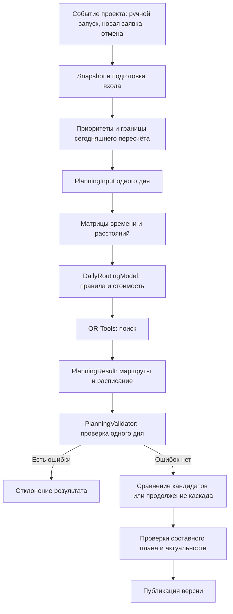

# Маршрутизация и валидатор: технический разбор с нуля

Состояние кода: 21 сентября 2026 года. OR-Tools 9.15.6755.
Документ предназначен для системного аналитика и разработчика без предварительного
знания OR-Tools. [Объяснение для нетехнического читателя](ROUTING_FOR_PRODUCT.md)
описывает те же процессы через пользовательские сценарии.

## 1. Три разных вопроса, на которые отвечает приложение

1. **Какой план выбрать?** Это задача оптимизации. Она включает отбор заявок,
   назначение инженеров и выбор порядка посещений.
2. **Корректен ли конкретный полученный план?** Это задача валидации: проверяем
   его относительно исходных данных и заявленных условий.
3. **Можно ли сейчас опубликовать этот план?** Это задача согласованности:
   учитываем другие дни, защищённые назначения, актуальность данных и версии.

В проекте эти задачи распределены между OR-Tools, прикладными сервисами,
валидаторами и репозиториями. Успешный `SolveWithParameters` не заменяет проверки
результата и транзакцию публикации.

## 2. Карта данных и вызовов



Каждая модель OR-Tools описывает **один день**. При вставке заявки со сроком сегодня это может быть
только изменяемая часть маршрута одного инженера. Один запуск пользовательского
сценария поэтому может содержать несколько запусков OR-Tools.

Основные файлы:

| Участок | Файл / функция |
| --- | --- |
| Подготовка входа и исходных штрафов | [`PlanningInputNormalizer`](../src/planning/application/services/planning_input_normalizer.py) |
| Многодневный остаток и иерархия штрафов | [`MultiDayPlanningService`, `_enforce_sla_hierarchy`](../src/planning/application/services/multi_day_planning.py) |
| Сегодняшние кандидаты и их сравнение | [`DynamicTodayPlanningService`, `_candidate_score`](../src/planning/application/services/dynamic_today_planning.py) |
| Защищённая часть | [`TodayRouteProtectionService`](../src/planning/application/services/today_route_protection.py) |
| Публичный адаптер OR-Tools | [`OrToolsPlanningSolver`](../src/planning/infrastructure/adapters/planning_solver_ortools.py) |
| Проверка дня | [`PlanningValidator`](../src/planning/application/validators/planning_result.py) |
| Проверка каскада | [`PlanningBatchValidator`](../src/planning/application/validators/planning_batch.py) |
| Проверка составного плана | [`DynamicPlanValidator`](../src/planning/application/validators/dynamic_plan.py) |

### Вход дневного расчёта

[`PlanningInput`](../src/planning/domain/entities/planning.py) содержит:

- дату, timezone и конфигурацию;
- подготовленные заявки `jobs` и доступных инженеров `engineers`;
- количество оборудования `equipment_units`;
- уже исключённые заявки `pre_unassigned`;
- snapshot с исходными данными и компонентами приоритетов;
- закреплённое оборудование, фиксированно активных инженеров и фиксированный пробег;
- общий дорожный snapshot события и при необходимости его дедлайн.

`Job` задаёт ID, координаты, длительность, окно начала, требования, штраф,
разрешённых исполнителей и признак `mandatory`. `Engineer` задаёт ID, координаты
доступного старта, транспорт, квалификации и границы доступной смены.

Для сегодняшнего дня координата старта может быть границей защищённого участка,
а начало доступного времени — временем после его завершения. Эти данные готовятся
прикладным кодом до solver.

### Выход дневного расчёта

`PlanningResult` содержит маршруты `Route`, их остановки `RouteJob`, неназначенные
заявки, статус, время расчёта, стоимости, исходные дорожные матрицы и метрики.
У остановки отдельно есть прибытие, начало, завершение и ожидание.

`pre_unassigned` тоже входит в обязательное покрытие результата. Заявка,
исключённая ещё при подготовке, не должна исчезнуть из итогового учёта.

## 3. Как OR-Tools представляет наших инженеров

Используется `RoutingModel`, специализированная модель маршрутизации. Это задача
типа VRPTW — распределение посещений с временными окнами. Общий подход показан
в [примере Google](https://developers.google.com/optimization/routing/vrptw).

| Понятие библиотеки | Смысл в проекте |
| --- | --- |
| `vehicle` | Позиция инженера в массиве, в том числе пешего |
| `node` | Номер точки во входе: заявка, старт или служебный конец |
| `index` | Внутренний индекс OR-Tools |
| `RoutingIndexManager` | Перевод между нашими nodes и внутренними indexes |
| `VehicleVar(index)` | Исполнитель заявки; `-1` означает пропуск |
| `NextVar(index)` | Следующая точка маршрута |
| `CumulVar(index)` | Накопленное значение измерения к этой точке |
| `assignment` | Найденное решение модели |

Например, при трёх заявках A, B, C и двух инженерах строки матрицы имеют порядок:
A, B, C, старт Анны, старт Бориса. Это номера 0–4. ID инженеров в БД могут быть
любыми; их vehicles при этом равны 0 и 1.

Фиктивный конец означает завершение после последней работы без возвращения
на базу. Дорожная матрица для него не запрашивается.

## 4. Дороги и единицы измерения

[`travel.py`](../src/planning/infrastructure/adapters/ortools_routing/travel.py)
получает отдельные матрицы `auto` и `pedestrian`. В рабочем дорожном режиме
используется локальная Valhalla; `STATIC_TEST` — явный тестовый режим.

`RoutingMatrices` хранит три представления:

| Поле | Назначение |
| --- | --- |
| `minutes` | Расписание и ограничения времени: округлённые вверх секунды / 60 |
| `seconds` | Исходное время дороги, оценка стоимости и проверки |
| `meters` | Исходное расстояние, оценка стоимости и проверки |

`None` обозначает отсутствие дороги. Нулевое время — другое значение, его нельзя
использовать вместо отсутствующего перехода.

Ключ snapshot включает профиль и обе координаты направленного перехода.
Первое полученное значение пары сохраняется для последующих кандидатов того же
события. Поэтому сравниваемые варианты не должны опираться на разные измерения
одного и того же уже полученного переезда.

Для расписания переезд в 61 секунду занимает 2 минуты. Для стоимости используются
настраиваемые единицы: по умолчанию 60 секунд и 10 метров. Каждая дуга округляется
отдельно: два переезда по 11 метров дают 2 + 2 единицы расстояния.

## 5. Как читать построение модели

Начните с [`OrToolsPlanningSolver.solve`](../src/planning/infrastructure/adapters/planning_solver_ortools.py),
затем откройте [`DailyRoutingModel.build`](../src/planning/infrastructure/adapters/ortools_routing/model.py).

```python
self._register_travel_callbacks()
self._add_time_and_distance_dimensions()
self._set_engineer_shifts()
self._set_job_windows_and_allowed_engineers()
self._forbid_missing_arcs()
self._forbid_time_infeasible_arcs()
self._add_equipment_constraints()
```

### Время и callback

Callback — функция, которой OR-Tools задаёт вопрос о переходе между двумя точками.
Функция `elapsed_minutes` возвращает:

```text
время перехода A → B = длительность работы A + дорога A → B
```

`Time` накапливает эти значения и разрешённое ожидание. Его значение на заявке —
время начала работы в минутах локального дня. На конце — завершение маршрута.
Механизм описан в [Dimensions](https://developers.google.com/optimization/routing/dimensions).

Переход к фиктивному концу имеет нулевую дорогу, **но сохраняет длительность
последней работы**. Иначе можно было бы начать перед концом смены и не учитывать,
что работа закончится уже после неё.

Начало маршрута фиксируется на подготовленной доступной границе смены.
Конец ограничивается её окончанием. Окно клиента ограничивает начало работы,
а отдельное ограничение требует завершить её в смену выбранного инженера.

### Исполнитель и пропуск

Совместимость включает все требуемые квалификации, транспорт, явную привязку
к инженеру и пересечение окна со сменой. Окончательную выполнимость полной
последовательности определяют остальные ограничения.

Для обычной заявки разрешены совместимые vehicles и `-1`. `AddDisjunction`
позволяет пропустить её за штраф. Для `mandatory` разрешены только исполнители,
без штрафного варианта пропуска. Так новая заявка со сроком сегодня становится обязательной
внутри модели проверяемого кандидата. Сам механизм описан в
[Penalties and Dropping Visits](https://developers.google.com/optimization/routing/penalties).

### Запрет переходов

Недоступную дорогу запрещают явно. Для перехода между заявками запрет зависит
от инженера: автомобильная и пешая доступность может различаться.

В `_forbid_arc_for_vehicle` используются три индикатора «не равно». Нельзя
одновременно назначить A и B конкретному инженеру и поставить B сразу за A.
Поэтому хотя бы один индикатор должен равняться 1. Это обычное логическое условие,
записанное через целочисленные переменные библиотеки.

Дополнительно исключаются переходы, заведомо несовместимые с окном или сменой.
Такая проверка пары точек не заменяет временные ограничения всей цепочки.

### Оборудование

Для каждого типа оборудования и инженера есть индикатор `uses`. Он включён,
если хотя бы одна работа инженера требует этот тип. Сумма новых выдач ограничена
остатком после уже закреплённых единиц.

Несколько работ одного инженера используют одну единицу типа оборудования.
Работы разных инженеров требуют отдельных единиц, даже если проходят в разное
время. Передача прибора внутри дня не моделируется.

## 6. Как план получает оценку

[`objective.py`](../src/planning/infrastructure/adapters/ortools_routing/objective.py)
не ищет маршруты. Он рассчитывает диапазоны и веса, по которым OR-Tools сравнивает
варианты.

```text
Objective =
    нормализованная стоимость пропусков × W_drop
  + число новых активных инженеров × W_engineer
  + общий изменяемый пробег × W_total_distance
  + максимальный полный пробег инженера × W_max_distance
  + время дороги
```

Веса вычисляются снизу вверх. Вес старшей цели больше максимальной возможной
суммы всех младших. Если младшая часть не может превысить 100, вес 101 делает
единицу старшей цели важнее любой экономии по младшей.

В прикладном слое штрафы уже закодировали SLA-группу, приоритет типа работ,
количество сохранённых заявок категории и вторичные приоритеты. OR-Tools
работает с числами и не интерпретирует названия типов работ самостоятельно.

Постоянную часть числа инженеров и общего расстояния можно не включать в
переменную стоимость: она одинакова для всех вариантов. Но максимум пробега
требует учитывать фиксированную часть маршрутов. Для этого модель добавляет
фиксированный пробег доступным инженерам и при необходимости служебный пустой
vehicle, сохраняющий максимум уже фиксированных расстояний.

Веса, диапазоны, общий делитель штрафов и версия алгоритма записываются
в `objective_metrics`. Для обычного случая это `WEIGHTED_SINGLE_PASS` /
`objective-range-v3`.

### Последовательный режим при переполнении общей оценки

Если `composite_maximum_objective >= 2**63 - 1`, подготовленный прикладным слоем
порядок включается как `LEXICOGRAPHIC_STAGES` / `objective-range-v5`:

1. отдельный этап минимизирует пропуски каждой пары «SLA-группа и приоритет
   типа работ» в порядке `CRITICAL → HIGH → MEDIUM → LOW`;
2. найденное значение добавляется в следующую модель как равенство;
3. после всех категорий финальный этап минимизирует число новых инженеров,
   общий пробег, максимальный пробег и время с прежними весами.

Внутри категории стоимость заявки равна `CountWeight + Secondary`, где
`CountWeight = sum(Secondary) + 1`. Поэтому сначала сравнивается число пропусков,
затем их вторичный penalty. Последовательность категорий эквивалентна прежним
доминирующим диапазонам: младший этап не может изменить равенством уже найденное
значение старшего.

Все этапы используют те же hard constraints и общий лимит времени. Маршрут
предыдущего этапа служит стартовым решением следующего. При лимите времени
фиксируется лучшее найденное, но не обязательно доказанно оптимальное значение;
итог получает `FEASIBLE_TIME_LIMIT`. Поэтому математический порядок целей тот же,
а конкретный эвристически найденный маршрут может отличаться.

Если описание этапов отсутствует, не совпадает со snapshot или отдельный этап
сам переполняет `int64`, сохраняется безопасная остановка
`OBJECTIVE_RANGE_OVERFLOW`. Подробный разбор и числа сохранённого случая:
[OBJECTIVE_OVERFLOW.md](refactoring/OBJECTIVE_OVERFLOW.md).

## 7. Что делает поиск и как появляется расписание

`search` сохраняет существующие настройки:

- `PARALLEL_CHEAPEST_INSERTION` для начального решения;
- `GUIDED_LOCAL_SEARCH` для дальнейшего улучшения;
- полное распространение ограничений через `use_full_propagation`;
- seed из конфигурации и оставшийся бюджет времени.

Свойства стратегий приведены в
[Routing Options](https://developers.google.com/optimization/routing/routing_options).
Это поиск с ограниченным временем, поэтому допустимый результат не обязательно
является доказанным глобальным оптимумом.

В синхронный бюджет входит построение модели. Общий дедлайн события дополнительно
ограничивает получение матриц и поиск. `solver_time_ms` не равен полной длительности
пользовательского сценария с очередью, дорогами и публикацией.

[`result.py`](../src/planning/infrastructure/adapters/ortools_routing/result.py)
читает выбранную последовательность `NextVar`. Затем `_extract_route` строит
конкретное самое раннее расписание:

```text
arrival = previous_finish + travel
start = max(arrival, window_start)
waiting = start − arrival
finish = start + service_duration
```

Не следует независимо брать нижние границы всех временных `CumulVar`: они могут
быть связанными интервалами, а не готовым согласованным расписанием.
Локальные минуты преобразуются в абсолютные UTC-времена результата.

## 8. Зачем нужен отдельный валидатор

Оптимизатор может корректно решить **неверно сформулированную нами задачу**.
Кроме того, между решением модели и публикацией есть преобразование индексов,
сборка расписания, подсчёт метрик и объединение результатов.

Валидатор повторно проверяет уже конкретный результат обычным Python-кодом.
Он не обращается к OR-Tools, не выполняет новый поиск и не исправляет план.
Например, если при построении модели забыть последнюю длительность работы,
проверка завершения в смене должна обнаружить ошибку в готовом расписании.

Независимость здесь означает отдельную проверку результата, а не полностью
независимую реализацию всей предметной области: предикат базовой совместимости
`is_base_compatible` разделяется с прикладным кодом, а входные данные и дорожный
snapshot используются те же.

## 9. Новый маршрут чтения дневного валидатора

Публичный контракт сохранён:

```python
errors = PlanningValidator().validate(data, result)
# [] — нарушений не обнаружено; иначе список диагностических сообщений.
```

[`planning_result.py`](../src/planning/application/validators/planning_result.py)
теперь показывает последовательность целиком:

```text
состав заявок
→ уникальность маршрута инженера
→ наличие, размер и значения матриц
→ ранний выход при ошибках матриц
→ каждый маршрут и общее оборудование
→ отчётные стоимости и objective
→ список ошибок
```

### 9.1. Состав результата

`_check_job_coverage` проверяет:

- дубли среди назначенных и среди неназначенных;
- пересечение этих двух списков;
- точное совпадение их объединения с `data.jobs` и `data.pre_unassigned`;
- назначение каждой обязательной заявки.

`_check_unique_engineer_routes` проверяет, что инженер не получил два маршрута
в одном результате дня.

### 9.2. Дорожные матрицы

`_check_matrices` проверяет профили, используемые маршрутами известных инженеров.
Ожидаемый размер — `(число заявок + число инженеров)²` для каждой из трёх матриц.
Ячейка может быть `None` либо неотрицательным `int`; `bool` и дробные значения
не считаются корректными целыми.

Если матрица отсутствует или повреждена, проверки останавливаются до обращения
к ячейкам. Это сохраняет диагностическую ошибку вместо случайного IndexError.
Наличие `None` само по себе допустимо; выбор отсутствующей дороги проверяется
при проходе по конкретному маршруту.

При пустом результате маршрутов обязательного запроса матриц нет: это сохраняет
пустую ветку solver.

### 9.3. Маршрут и его остановки

[`RouteChecks`](../src/planning/application/validators/planning_result_routes.py)
создаётся отдельно на каждый вызов. Объект содержит только контекст этой проверки,
поэтому переиспользуемый `PlanningValidator` не накапливает состояние.

`_check_route` проверяет известность инженера, непустой маршрут, границы смены,
порядковые номера и существование каждой заявки. Для известных заявок вызывает:

| Метод | Что проверяет |
| --- | --- |
| `_check_visit_times` | Совместимость, локальную дату, окно начала, смену, прибытие от предыдущего завершения, ожидание, длительность, неотрицательные показатели |
| `_check_visit_travel` | Время и расстояние выбранной дуги по матрицам, наличие исходных секунд; возвращает время в единицах objective |

После остановок проверяются время окончания маршрута, суммы дороги, работ,
ожидания, расстояния и множество необходимого оборудования.

Например, A завершилась в 08:50, дорога A → B занимает 10 минут, окно B открывается
в 09:30. Корректны прибытие 09:00, ожидание 30 минут и начало 09:30. Прибытие 08:55
с прежними исходными значениями даёт `job ... has broken travel sequence`.

### 9.4. Общий склад

Счётчик оборудования сначала содержит все заранее закреплённые выдачи. Для каждого
маршрута добавляется множество требуемых типов за вычетом уже выданных этому
инженеру. Затем счётчик сравнивается с `equipment_units`.

Это важно: сравнение только количества приборов внутри отдельного маршрута
не обнаружило бы, что одна единица одновременно выдана двум инженерам.

### 9.5. Стоимости и оценка

[`check_costs_and_objective`](../src/planning/application/validators/planning_result_objective.py)
пересчитывает отчётные `drop_cost` и `travel_cost`. Затем по маршрутам получает
единицы пробега, максимум с фиксированной частью, время дороги и число инженеров.
Проверяет верхние границы, количество фиксированных и новых инженеров,
переданные fixed costs и равенство итоговой оценки составной формуле.

Веса, делитель и границы читаются из `objective_metrics`; функция **не строит их
заново по полному исходному набору**. Для старого результата без этого словаря
сохранена проверка `objective == drop_cost + travel_cost`.

`travel_cost_per_minute` участвует в отчётном `travel_cost`. Он не подменяет
пятиуровневую objective текущего solver.

## 10. Что происходит после проверки дня

В `MultiDayPlanningService` сначала вызывается дневной валидатор. При ошибках день
не принимается как успешный. Затем `PlanningBatchValidator.validate_day` проверяет
переход каскада: дату в горизонте, принадлежность заявок остатку, отсутствие
повторного назначения с предыдущего дня и наличие решений по приоритету.

`DynamicTodayPlanningService` проверяет и полный пересчёт сегодняшнего дня,
и отдельные кандидатные маршруты для заявок со сроком сегодня. Невалидный кандидат не допускается
к выбору победителя. Проверенные сегодняшние варианты сравниваются отдельным
вектором; напрямую сравнивать `ObjectiveValue` разных моделей нельзя, потому что
их веса могут отличаться.

`DynamicPlanValidator` проверяет составной план: защищённые назначения,
привязку сегодняшних работ, уникальность, горизонт, даты, последовательности
и непрерывность времени, включая явно сохранённую границу перепланирования.
При специальных событиях отмены и недоступности применяются их отдельные правила.

Проверка актуальности snapshot и атомарная публикация выполняются прикладной
обвязкой и репозиториями. Они не перенесены внутрь `PlanningValidator`.

## 11. Границы проверок, которые нельзя скрывать в объяснении

- Валидатор проверяет допустимость и согласованность выбранного плана, а не
  глобальную оптимальность и не невозможность назначить каждую оставшуюся заявку.
- Он использует тот же snapshot: ошибочные исходные сведения или устаревшие
  дорожные данные не становятся верными от повторной проверки.
- Это проверка внутреннего типизированного результата, а не универсальный парсер
  произвольного JSON. При частично заполненном `objective_metrics` прежний код
  мог выбрасывать `KeyError`; стилистический рефакторинг сохранил этот контракт.
- Не все диагностические поля `objective_metrics` независимо пересчитываются.
  Веса и границы берутся из результата; проверка их построения остаётся у solver
  и его тестов. Нельзя представлять валидатор как полное доказательство каждой
  сохранённой метрики.
- Суточный валидатор не заменяет проверки других дней и защищённого префикса.
- Решения по лимиту времени могут быть допустимыми без доказанного оптимума.
  Даже `OPTIMAL` отдельной модели не означает оптимальность всего каскада.

Последовательный режим добавляет проверяемый контракт этапов: валидатор сверяет
его со snapshot, проверяет порядок, полное однократное покрытие optional-заявок,
стоимости, границы, зафиксированные значения и текущую objective. Прежние
однопроходные результаты по-прежнему проверяются по старым правилам.

## 12. Что показало ревью и как проверено сохранение поведения

Отменённый двухэтапный эксперимент не использован: он грубо разделял только
«пропуски» и «маршрут». Текущая реализация создаёт отдельный этап для каждого
бизнес-уровня и тем самым повторяет полный порядок исходной штрафной иерархии.
Доказательство, ограничения и проверки описаны в
[OBJECTIVE_OVERFLOW.md](refactoring/OBJECTIVE_OVERFLOW.md).

### OR-Tools перед работой над валидатором

Проверены построение ограничений, привязка callbacks к профилям, optional/mandatory,
последняя работа в смене, оборудование, фиксированный пробег, поиск и извлечение
расписания. Формулы objective дополнительно сопоставлены по структуре Python-кода
после нормализации переименований и комментариев.

На 32 контрольных наборах без нового режима все поля результатов, кроме
фактического времени выполнения, либо тип и текст исключения совпали с версией
до рефакторинга. Для нового режима отдельно проверены сохранённый набор из
16 заявок, синтетический набор из 100 заявок и исчерпывающее сравнение всех пар
подмножеств восьми заявок с прежней штрафной функцией.

### Валидатор до и после разделения

- Исходный метод из 305 строк разделён на понятный сценарий и две группы проверок:
  маршруты/оборудование и стоимость/objective.
- Сохранены сигнатура, проверки, тексты и порядок ошибок, ранний выход при проблемах
  матриц, старая формула без metadata и поведение исключений.
- 64 новых проверки сначала прошли на исходном валидаторе. Они намеренно повреждают
  расписание, назначения, матрицы, оборудование и метрики.
- Старый и новый валидаторы сопоставлены на 96 вызовах из unit-тестов и на
  250 дополнительных наборах с сочетаниями нарушений. Совпали полные списки ошибок
  в исходном порядке либо исключения; входные объекты не менялись.
- Итоговый прогон после добавления последовательных целей: **213 backend-тестов**,
  включая **9 PostgreSQL-тестов**; пропусков нет. Проверка Ruff и форматирования
  изменённых файлов успешна.
- Структура исходных блоков покрытия, уникальности, матриц, времён визита и стоимости
  дополнительно сопоставлена после извлечения в функции: выражения совпадают.

Протоколы: [текущий backend JUnit](refactoring/lexicographic-routing-tests.xml),
[сравнение обычного режима](refactoring/lexicographic-nonoverflow-comparison.json),
[сравнение валидаторов](refactoring/validator-comparison.json),
[повторное сравнение OR-Tools](refactoring/routing-review.json).
Проверки контракта: [test_planning_result.py](../tests/unit/application/validators/test_planning_result.py).

Это проверки сохранения поведения на рассмотренных входах, а не формальное
доказательство для всех возможных данных и не нагрузочный тест максимального объёма.

Для повторного запуска:

```sh
.venv/bin/python -m pytest tests/unit/application/validators/test_planning_result.py -q
.venv/bin/python -m pytest tests/unit -q
# Для включения PostgreSQL-тестов задать TEST_POSTGRES_DSN тестовой БД:
.venv/bin/python -m pytest tests -q
```

## 13. Как вносить следующую доработку

Если меняется бизнес-ограничение, нужно описать его на двух уровнях: как solver
должен выбирать допустимый план и как валидатор должен обнаружить нарушение
в уже готовом результате. Затем добавить положительный сценарий и намеренно
нарушенный результат.

Например, для будущего требования возвращаться на базу недостаточно поменять
стоимость последней дуги. Потребуются дорога к базе, время возврата, согласованные
границы смены, извлечение результата и новая независимая проверка.

Если меняется только организация кода, как в этой работе, новые правила не
добавляются: сравниваются прежние и новые результаты, ошибки и побочные эффекты.
Подробное описание действующих use cases и требований также есть в
[ROUTING_ALGORITHM.md](ROUTING_ALGORITHM.md).
